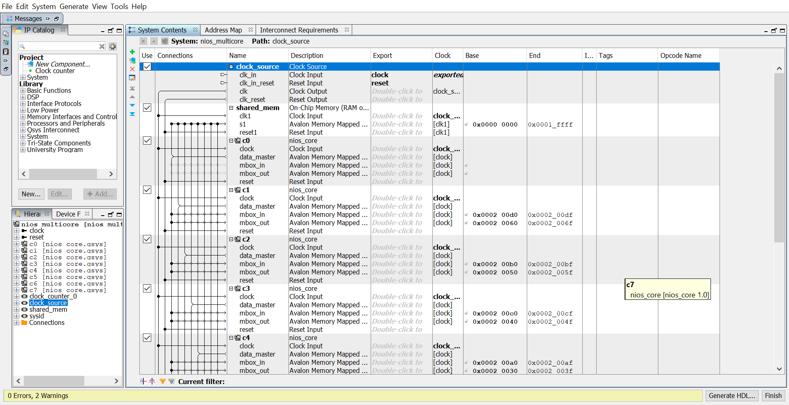
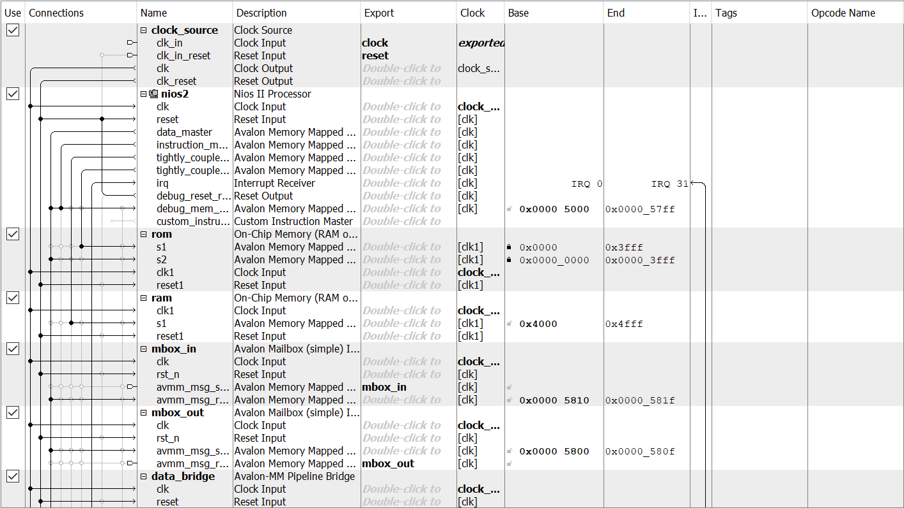
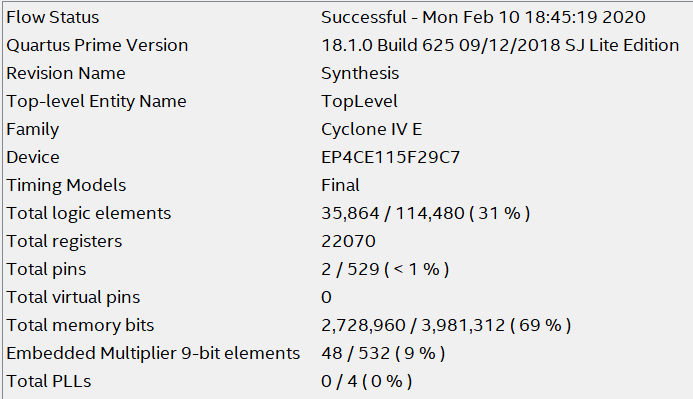
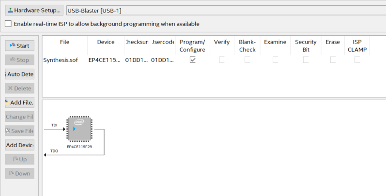
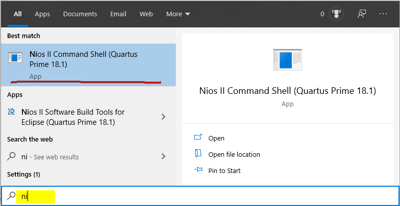
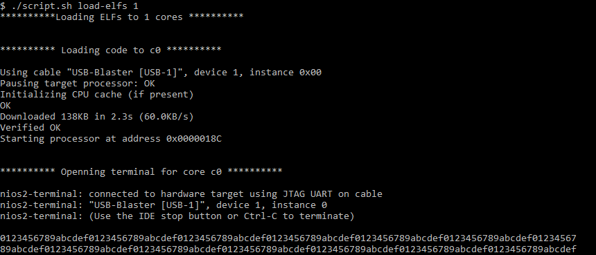
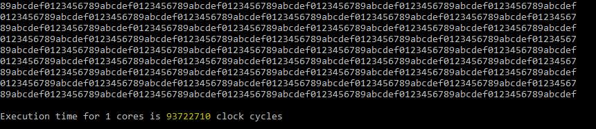

# Introduction

I have made this toy project for the Terasic DE2-115 board to demonstrate how a multi-core system can be built in FPGA using Intel Quartus and Platform Designer tools. The software part of the system performs matrix multiplication in parallel using 8 Nios II cores. Mailboxes (hardware blocking queues with capacity of 1), and shared memory were used to implement inter-processor communication.

# System structure
The system consist of 8 cores that communicate through mailboxes and shared memory. A simplified view of the system is shown on the picture below. Though it only shows two cores, it should be enough to recognize how the 8-core system is organized.


Each core has its own data memory (RAM) and program memory (ROM). Ideally, the program memory could be shared to implement the [SPMD](https://en.wikipedia.org/wiki/SPMD) technique. However, this would have caused additional complications in Platform Designer environment. So, in this example I used separate ROMs and separate executables for each core.

The system has two types of cores: main and secondary. They have no differences internally, but are connected in a different way to each other.

Each core has a couple of mailboxes: hardware modules that act as one-element blocking queues. The receiver can wait on a mailbox until the sender leaves a message in it. 

The main core does not use its mailboxes. The only reason they are there is because all cores are replicas of the same subsystem. The main core has access to the mailboxes of the secondary cores: it uses their input mailboxes to signal about readiness of data in shared memory,  and their output mailboxes to wait for a signal from them when they finish their job. 

# Matrix multiplication

Matrix multiplication problem demonstrates how this system can process data in parallel. The source code for the problem can be found in the [main.c](Eclipse/src/main.c) file.

This program uses conditional compilation directives, so it compiles to different executables based on the target core ID provided to the compiler. Compilation for all cores is done automatically by a script described in one of the following sections.

The program compiled for the main core (`CORE_ID = 0`) functions as follows. First, it allocates matrices `a`, `b` (operands) and `c` (the result) in the shared region of memory. Then, it initializes the operands and flushes the cache. Flushing is crucial here, because Nios II processor does not implement any cache coherency protocols. As a result, before some piece of data in the shared region can be accessed by other processors, the writer must make sure that the data actually went to memory. After flushing, the main core starts measuring the execution time and sends messages to all secondary cores through their input mailboxes. Then, the core determines its own part of matrix multiplication job and starts working on it. Once the job is done, the core waits on the output mailboxes of the secondary cores to make sure that they have finished their tasks. Finally, the core stops the measurement of execution time, prints the result, and enters the infinite loop.

The program compiled for the secondary cores starts with waiting on the input mailbox until it receives a signal from the main core. Then, based on the `CORE_ID` it decides which part of the multiplication job should be done. Knowing that, it starts the multiplication. Once the job is done, the program flushes the secondary core's cache. Without this step, the main core may not see a valid result, since some part of it may only reside in the secondary core's cache. Finally, the program signalizes to the main core about finishing its job and enters the infinite loop.

# Viewing the system

## Platform designer
Platform designer is a GUI tool that comes together with Intel Quartus. The tool allows to drag and drop various hardware components such as Nios II processors, block RAM, memory controllers, DMA controllers inter-process communication primitives and other modules. The components can be connected to each other by different interfaces such as Avalon and AXI3.

To open Platform Designer, first open Quartus Prime and then click Tools -> Platform Designer. Once it starts, click File -> Open... and choose the [nios_multicore.qsys](Qsys/nios_multicore.qsys) file from this repository. Now you observe and edit this system:



## Subsystems
Platform designer allows creating subsystems to make resources replication easier. In other words, you can put some components together, place them inside a module (subsystem), and then instantiate it as many times as you need. If, later, you need make any changes to the module, it is done in one place; all instances of that module will be updated automatically. Though this mechanism may be helpful for making multi-core systems, it is quite primitive, because it does not allow to parametrize subsystems.

In my multi-core Nios II system, I placed the processor, RAM, ROM, and two mailboxes into a subsystem, which I call a core. After that I replicated it eight times and connected these higher level components together. Lack of parametrization, does not allow cores to be different which leads to inefficient recourse utilization. For example, the main core does not need mailboxes, but contains them. Moreover, the RAM and ROM size of the cores is identical, but the secondary cores need less memory because they do no use `printf` function.

If you want to observe how a core looks like inside, right click over any of the 8 cores and select Drill into subsystem:



To go back to the larger view, right click over any module and choose Move up.

# Running the system
## HDL synthesis
To test the system you need to synthesize the hardware first. Open `Quartus/Synthesis.qpf` project in Quartus Prime. Ignore IP upgrade warning. Select Processing -> Start Compilation. Wait until the process finishes (may take a while, because the system is quite big). A successful synthesis result should look as follows:



## Loading hardware configuration to FPGA
Connect DE2-115 to your PC via USB. Choose Tools -> Programmer in Quartus Prime:



Click Start to load `Synthesis.sof` to the board.

## Opening Nios II Command Shell
Board support packages (BSP) contain code for working with hardware modules. For example, it may contain physical addresses of the modules, so that one does not need to hardcode them into the user code and update them manually once they are changed in Platform Designer. In the Quartus Prime environment BSPs are generated based on hardware design by just clicking a few buttons. However, each processor in a system must have its own BSP. Thus for a system with many cores manual BSP generation may be tedious. That is why I designed a script that automates BSP creation and project compilation for any number of processors. The script also configures BSPs such that they become aware of the shared memory region. For more details about how BSPs are configured, look at the content of [](script.sh).

The script runs in the environment of the Nios II Command Shell, which comes with Quartus Prime and can be found using Windows 10 search panel:



After starting the shell, `cd` to your local copy of this repository to be able to run `script.sh`:

```cd "C:\<path-to-repo>\MulticoreNios"```

The script may potentially run on operating systems other than Windows 10, but it has not been tested in other environment.

## Generating BSPs and projects
Generate BSP for the required number of cores. In the current version you can choose any number of cores from 1 to 8. The following example uses 8 cores:

```./script.sh generate-bsp 8```

Regardless of your choice, the hardware system contains 8 cores, so the numbers you specify will only determine how many cores will execute the program.

## Compiling projects
To automatically build a separate executable for each core, run the following command:

```./script.sh make-projects 8```

The number of cores (the second parameter) should match the number of cores used in the previous step.

## Running executables on Nios II cores
To automatically load executable files to Nios cores, make sure you connected the DE2-115 board to your PC via USB-Blaster and run the following command:

```./script.sh load-elfs 8```

Again, the number of cores should match the number of cores used in the previous steps. The script loads executables for the secondary cores first and then it loads the executable to the main core. After that, you should be able to see the output printed by the main core in the same window:





The script prints the result of the multiplication of the identity matrix by a matrix with single-digit hexadecimal values as elements. It also prints the execution time, so that it can be used to estimate the efficiency of parallelization.

Press Ctrl+C to stop the script and return to the command window.

# Performance evaluation
The following table contains execution time for the same matrix (104x104 elements) multiplication program, but running on a different number of cores:

| \# of cores | Execution time (cc) | Speedup | Efficiency |
| ----------- | ------------------- | ------- | ---------- |
| 1           | 93722710            | 1.000   | 1.000      |
| 2           | 46958379            | 1.996   | 0.998      |
| 4           | 23551266            | 3.980   | 0.995      |
| 8           | 11864200            | 7.900   | 0.988      |

It is clear from the table that the task can be extremely efficiently parallelized by at least 8 cores.